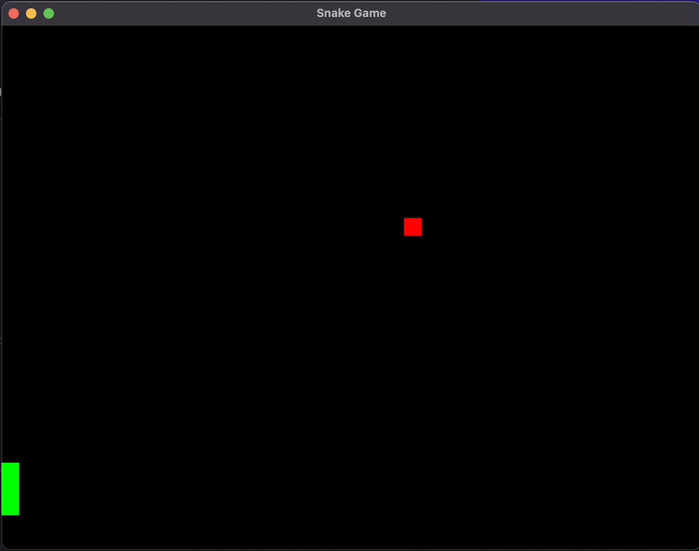

# SnakeGame

- Snake Game Board developed with C++.
- Used [SFML library](https://www.sfml-dev.org/).

  

## How to Run the App ?

1. Step1: Navigate to build directory.
2. Step2: Run `cmake ..`
3. Step3: Run `make`
4. Step4: Run `./snake_game`

By executing above steps, the Snake Game board will open as shown above.

## How to Play ?

1. Press any arrow keys to start.
2. Once, the Snake started moving ensure the snake doesn't hit the boarders. If snake hits the board then the game is lost.
3. By Collecting the Food, the Snake length will increase.
4. To increase the snake speed update the MOVE_INTERVAL in src/main.cpp to 0.1f.
